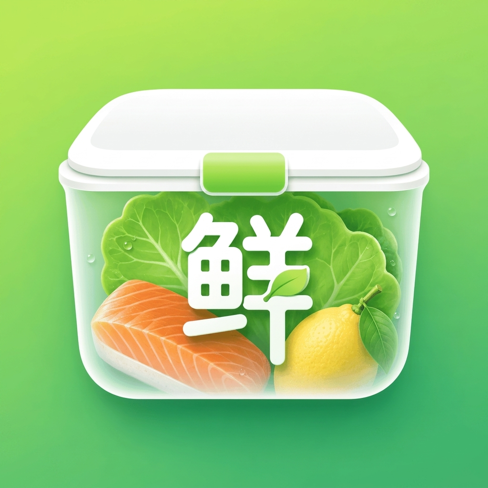
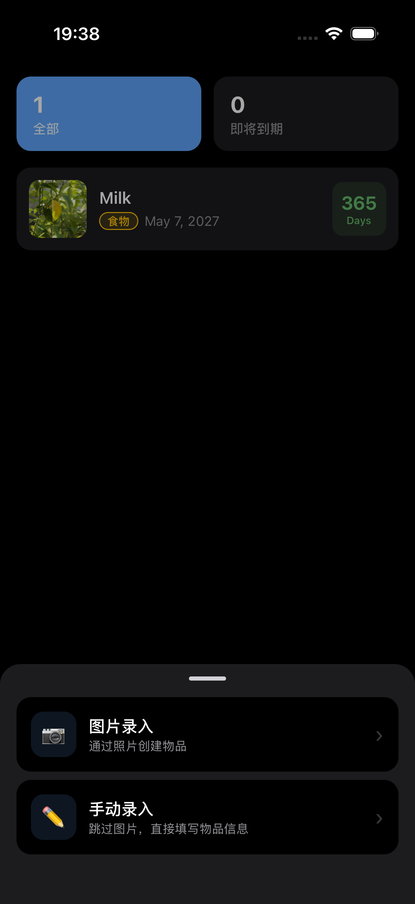
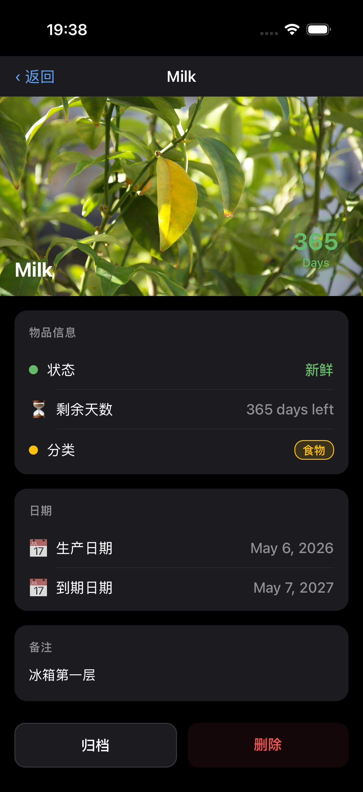
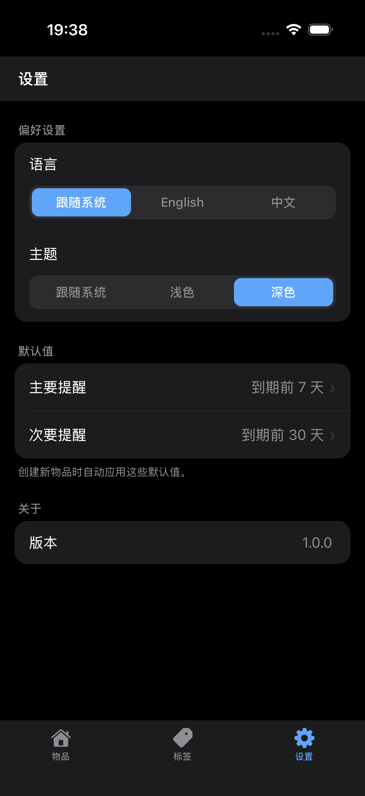

<div align="center">
  
  <h1>鲜管家 (FreshKeeper) 🍎</h1>
  <p><em>帮你在物品过期前及时掌握状态，轻松管理家中所有物品。</em></p>

[**English Documentation**](../README.md)

  <br />
  
  
  &nbsp;&nbsp;&nbsp;&nbsp;
  
  &nbsp;&nbsp;&nbsp;&nbsp;
  
  <br />
  <br />
</div>

---

## 🌟 为什么选择鲜管家？

鲜管家专为日常家庭使用而设计。无论你想避免冰箱食材被遗忘、药品过期，还是护肤品放太久，它都能帮你用简单的方式保持有序，减少浪费。

## ✨ 主要功能

- 📅 **过期追踪**：追踪食品、药品、护肤品和日用品的到期日期。
- ⚡ **便捷录入**：支持手动添加物品，也可通过照片创建。
- 📸 **视觉记录**：保存包装照片，方便之后查看。
- 🏷️ **整理分类**：使用标签整理物品，支持多标签。
- 🔔 **智能提醒**：在到期前设置提醒。
- 🔍 **快速检索**：按名称、标签或分类搜索。
- 🗄️ **历史归档**：归档旧物品，同时保留历史记录。
- ☁️ **多端同步**：通过 iCloud 在多设备间同步。

## 💡 提前掌握到期状态

鲜管家帮你清楚了解哪些物品仍然新鲜、哪些即将到期、哪些需要优先处理。与其等到发现时已经太晚，不如提前安排，及时使用。

### 更快录入物品

基于照片的录入方式，让记录物品信息和保存视觉参考更轻松。对于经常购买、之后还需要核对的商品，这是一种更实用的管理方式。

### 为真实生活而设计

鲜管家可用于管理：

- 🧊 **冰箱和储藏柜**：各类食材、零食
- 💊 **健康与药品**：日常备药、保健品
- 🧴 **美妆与护肤**：护肤品、化妆品
- 🍼 **母婴用品**：奶粉、辅食、婴儿用品
- 🐾 **宠物用品**：宠物粮、零食、药品
- 📦 **其他家中物品**：任何有日期管理需求的物品

## 💎 高级版

鲜管家提供可选高级订阅，适合更高频、更进阶的使用场景，包括无限制照片创建物品及更多高级功能。

## 🚀 开发说明

本项目基于 [React Native](https://reactnative.dev/) 和 [Expo](https://expo.dev/) 构建。

### 前置条件

- Node.js
- npm / yarn / pnpm

### 运行步骤

```bash
# 1. 安装依赖：
npm install

# 2. 启动开发服务器：
npm start

# 3. 在设备或模拟器上运行：
# - 按 `a` 运行 Android 版本
# - 按 `i` 运行 iOS 版本
# - 按 `w` 运行 Web 版本
```

---

## 📦 打包方案

本项目使用 [EAS Build](https://docs.expo.dev/build/introduction/)（Expo Application Services）进行打包，支持 iOS 和 Android 双端构建。

### 前置条件

- 安装 EAS CLI：

  ```bash
  npm install -g eas-cli
  ```

- 登录 Expo 账号：

  ```bash
  eas login
  ```

### 🍎 iOS 打包

#### 开发预览包（Development Build）

用于本地调试，安装到真机后可连接开发服务器：

```bash
eas build --platform ios --profile development
```

#### TestFlight 测试包

提交至 TestFlight 供内测用户测试：

```bash
eas build --platform ios --profile preview
```

#### App Store 正式包

构建用于提交 App Store 的生产包：

```bash
eas build --platform ios --profile production
```

构建完成后提交审核：

```bash
eas submit --platform ios
```

### 🤖 Android 打包

#### APK（直接安装）

生成可直接安装的 APK 文件，适合内部测试分发：

```bash
eas build --platform android --profile preview
```

#### AAB（Google Play）

生成用于上传 Google Play 的 AAB 格式包：

```bash
eas build --platform android --profile production
```

构建完成后提交 Google Play：

```bash
eas submit --platform android
```

### 🔄 其他构建命令

**双端同时构建**

```bash
eas build --platform all --profile production
```

**OTA 热更新**

无需重新提交应用商店，直接推送 JS 层更新：

```bash
eas update --branch production --message "描述本次更新内容"
```

> **注意**：OTA 更新仅适用于 JS/资源层变更，原生代码变更仍需重新打包提交。

### ⚙️ eas.json 配置参考

项目根目录的 `eas.json` 定义各环境的构建配置，典型结构如下：

```json
{
  "cli": {
    "version": ">= 16.0.0"
  },
  "build": {
    "development": {
      "developmentClient": true,
      "distribution": "internal"
    },
    "preview": {
      "distribution": "internal"
    },
    "production": {
      "autoIncrement": true
    }
  },
  "submit": {
    "production": {}
  }
}
```

如项目根目录尚未存在 `eas.json`，可通过以下命令初始化：

```bash
eas build:configure
```

---

<div align="center">
  <p>由 FreshKeeper 团队用 ❤️ 打造</p>
</div>
